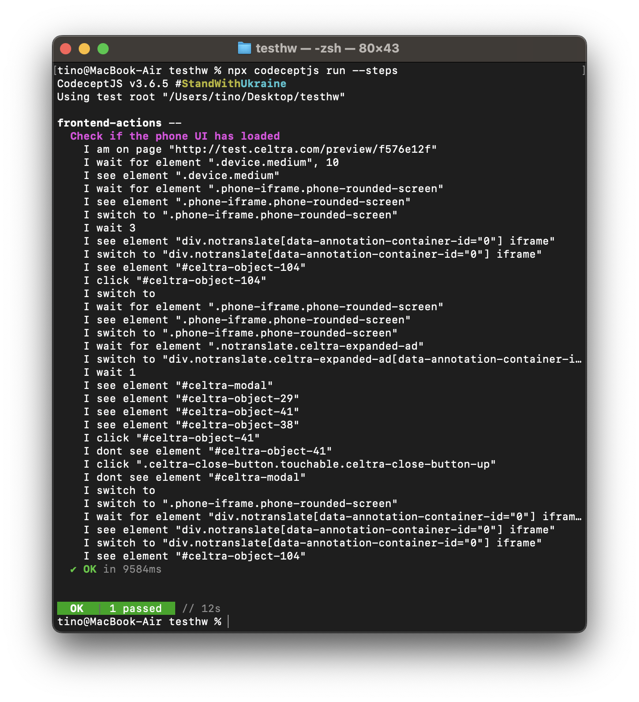

# Celtra Homework for QA Engineer Internship

## Overview

This repository contains the CodeceptJS test scripts for the Celtra homework assigned as part of the QA Engineer internship process.

## I used:
- CodeceptJS
- Playwright
- Allure

## What's implemented:
The entire test scenario which was given (steps 1-10) is being automated using Google Chrome. The test also runs in parallel using multiple browsers and advanced reporting is implemented using Allure. I am unsure about the test script running independently of any browser, but we can discuss this on the technical interview.

